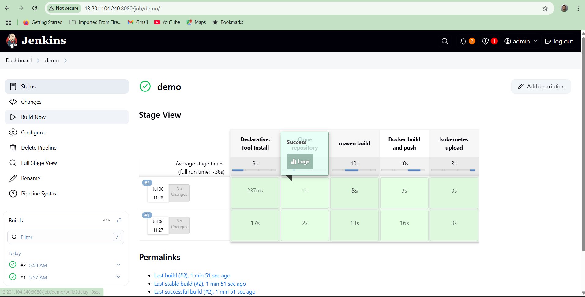
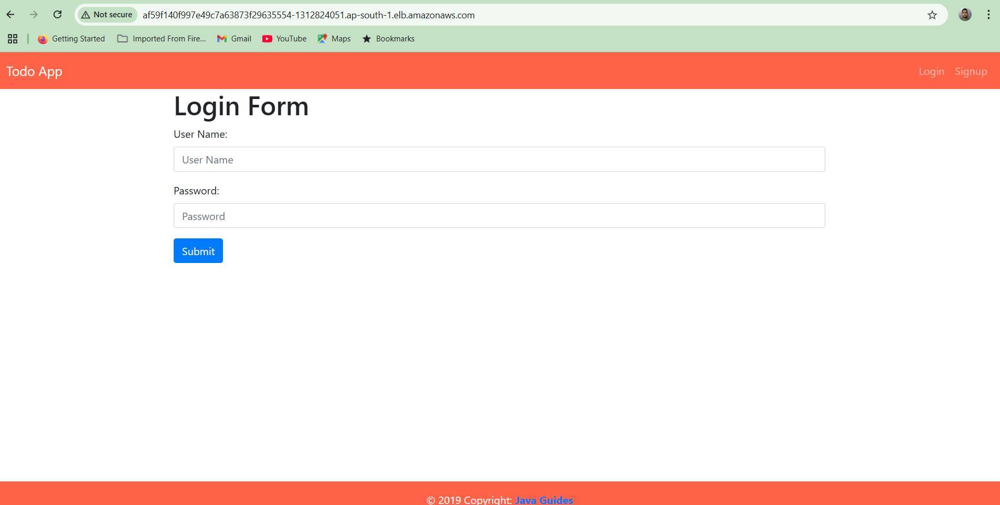

# Todo Application
Todo application developed using JSP, Servlet, JDBC and MySQL Database.

## Following features
- Add todo
- Edit todo
- List Dodo
- Delete Todo
- Login
- Signup
- Responsive layout

## Technology stack
- Java 8+
- JSP and Servlet
- JDBC
- MySQL database
- Eclipse IDE
- Tomcat server 8+

## Blog post to develop this project from scratch

Refer blog tutorial at 
<a href="https://www.javaguides.net/2019/10/build-todo-app-using-jsp-servlet-jdbc-and-mysql.html">Build Todo App using JSP, Servlet, JDBC and MySQL</a>

---
This is a ready-to-use to-do application for managing tasks, built using Java and JSP. It allows users to register, log in, and manage their to-do lists. The app is deployed on Kubernetes and runs on AWS, with everything fully automated using modern DevOps tools.

The project combines a traditional Java web application with a cloud-based setup. It uses Jenkins for continuous integration and delivery (CI/CD), Docker to create containers, Kubernetes (on AWS EKS) to manage those containers, and Terraform to set up and manage the cloud infrastructure.


## Usage Instructions
### Prerequisites
- Java Development Kit (JDK) 8
- Maven 3.9+
- Docker 20.10+
- AWS CLI v2
- kubectl 1.32+
- Terraform 1.0+

### Installation

1. Clone the repository:
```bash
git clone https://github.com/Manikanta07022002/test.git
cd test-master
```

2. Build the application:
```bash
mvn clean package
```

3. Build and push the Docker image:
```bash
docker build -t todo-app .
docker tag todo-app:latest <your-ecr-repo>/todo-app:latest
docker push <your-ecr-repo>/todo-app:latest
```

4. Deploy the infrastructure:
```bash
cd terraform
terraform init
terraform plan
terraform apply
```

5. Deploy the application to Kubernetes:
```bash
cd ../manifests
kubectl apply -f mysql.yml
kubectl apply -f tomcat.yml
kubectl apply -f ingress.yml
```

### Quick Start
1. Access the application through the ALB DNS name provided by the ingress controller
2. Register a new user account
3. Login with your credentials
4. Start managing your todo items


## Data Flow
The application follows a traditional MVC pattern with a layered architecture for data processing.

```ascii
[User] -> [Ingress/ALB] -> [Todo App Pod] -> [MySQL Pod]
                                  |
                                  v
                          [Data Processing]
                          1. Validate Input
                          2. Process Request
                          3. Update Database
                          4. Return Response
```

Component Interactions:
1. User requests are routed through AWS ALB Ingress
2. Requests are load balanced across multiple todo-app pods
3. Application authenticates users against MySQL database
4. Todo operations are persisted in MySQL
5. Responses are returned through the same path

---
## Infrastructure

### AWS Resources
- EKS Cluster
  - Version: 1.32
  - Node Group: t2.small instances (SPOT)
  - Addons: CoreDNS, kube-proxy, VPC-CNI, metrics-server

- EC2 Instance (Jenkins)
  - Type: t2.small
  - Security Group: Ports 22, 80, 443, 8080

- Networking
  - VPC: Default VPC
  - Subnets: ap-south-1a, ap-south-1b
  - Security Groups: Jenkins and EKS specific

---
## Deployment
1. Prerequisites:
   - AWS credentials configured
   - kubectl configured for EKS cluster
   - Docker image pushed to ECR

2. Deployment Steps:
```bash
# Deploy infrastructure
cd terraform
terraform init
terraform apply

# Configure kubectl
aws eks update-kubeconfig --name test --region ap-south-1

# Deploy application
cd ../manifests
kubectl apply -f .
```

3. Verify deployment:
```bash
kubectl get pods
kubectl get svc
kubectl get ingress
```
---
###  Jenkins Pipeline


###  Login Page of TODO App

